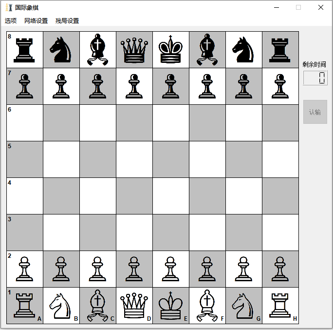
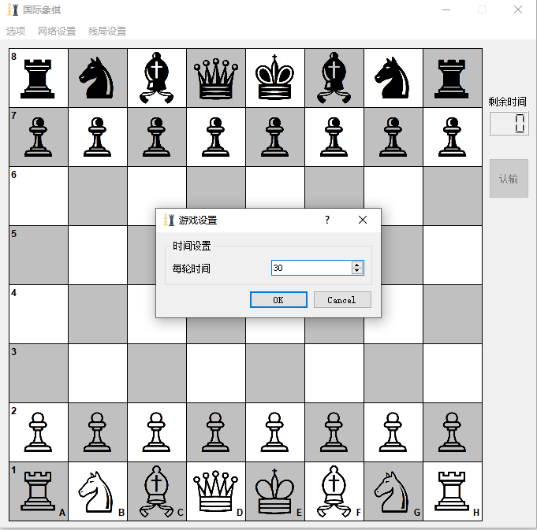
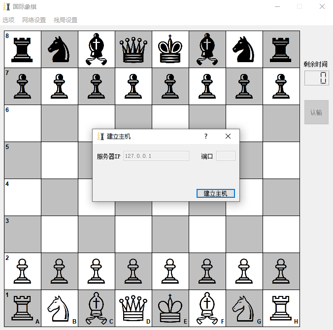
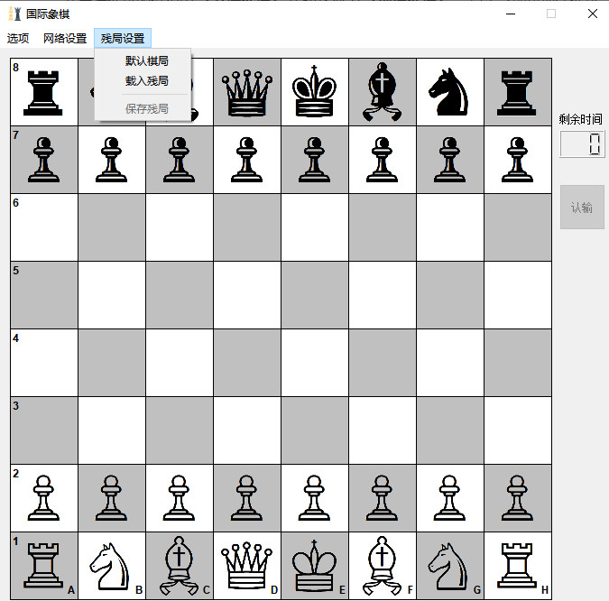
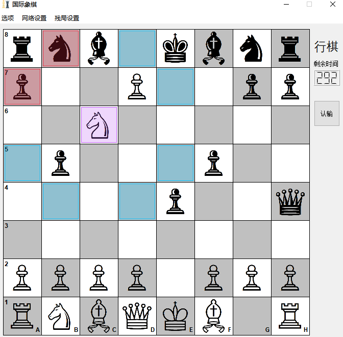
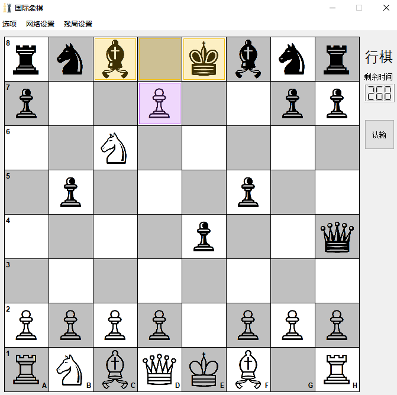
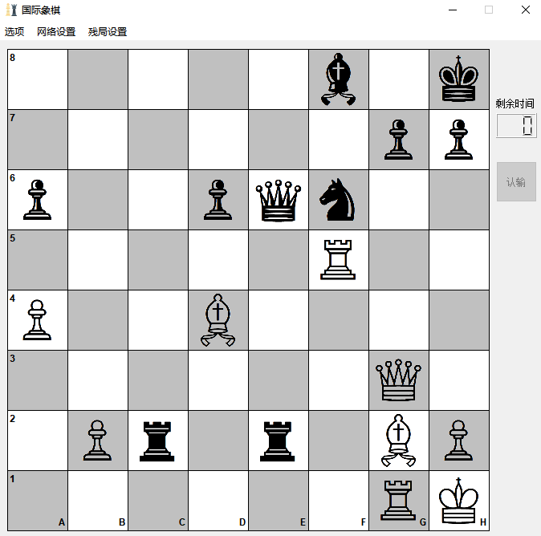

# ChessOnline

一个使用 Qt 和 Socket 实现的简易网络象棋对战程序，当前为 `v1.0b` 测试版。

## 界面介绍

### 主界面



主界面包含 **菜单栏** 、 **棋盘** 、 **计时器** 和 **认输按钮** 。

### 菜单栏

#### 选项

**选项** 中包含 **游戏设置** 功能，点击后会打开一个游戏设置界面，可以输入数字决定游戏中双方每次操作的最长时间（单位：秒，范围1s~999s），点击 **【OK】** 即可完成设置。游戏默认操作时间设置为30秒。



#### 网络设置

**网络设置** 中包含 **建立主机** 和 **连接主机** 功能。

点击 **建立主机** ，显示建立主机窗口，点击 **【建立主机】** 即开始等待连接， **“端口”** 后的文本框将显示监听的端口号。连接成功将自动开始游戏。主机执白。

在等待连接的过程中 **【建立主机】** 按钮将变为 **【取消建立】** ，点击之即可取消监听。



点击 **连接主机** ，显示连接主机窗口，输入主机地址和端口号后，点击 **【开始连接】** 即开始尝试连接，若主机号/端口号输入错误会进行提示，10s仍无法连接则超时。连接建立后自动开始游戏，主机执白。

在等待连接的过程中 **【开始连接】** 按钮将变为 **【取消连接】** ，点击之即可取消连接。

#### 残局设置

**残局设置** 中包含 **默认棋局** 、 **载入残局** 和 **保存残局** 功能。

点击 **默认棋局** 将载入标准国际象棋的起始局面，白方先行。

点击 **载入残局** 将打开文件选取对话框，文件内需按后文标准存有一个残局。成功载入残局后主界面的棋盘会相应改变。开始游戏时， **主机载入的残局会发送给客机载入** 。主机执白。

以上两个功能只能在游戏开始前点击。

点击 **保存残局** 将打开文件保存对话框，文件命名后，残局将被保存至所选文件。残局保存占用操作时间，任意一方都可以保存，保存残局对游戏过程无影响。

**保存残局** 只能在游戏过程中进行。



### 棋盘

棋盘为 $8 \times 8$ 的标准国际象棋棋盘。

当己方进行操作时，用鼠标左键点击己方棋子可以将其选中，该棋子所在格和能走到的格子将被标出。标出格子的

颜色代表不同含义：

- 紫色：选中的棋子
- 蓝色：仅移动
- 红色：吃
- 黄色：兵升变





一些特殊规则的移动，如 **王车易位** 在该版本尚未实装。

### 计时器

计时器用3位数字显示剩余秒数，用 “行棋” 或 “等待” 标志当前状态。

行棋时，剩余时间将不断减少，减少至0时，将因超时输掉比赛。

### 认输按钮

对局中，任何时候点击该按钮都将认输，对方赢得比赛。

## 残局规范

残局文件第一行 `white` / `black` 代表以下是哪一方的棋子，并且现在轮到该方走子。

之后不超过6行，每行第一个字符串代表棋子类型，第二个数字代表该种棋子数目（需大于0），之后若干棋子位置，用空格隔开

棋子位置坐标为小写字母 `a` - `g` 加数字 `1` - `8` ，同一个坐标内部无其他字符。坐标对应的格子见棋盘。

走子方棋子记录完毕后，记录另一方 `black` / `white` ，格式与上述类似。

如下图棋局对应残局为：



```
white
king 1 h1
queen 1 g3
rook 2 g1 f5
bishop 2 g2 d4
pawn 3 a4 b2 h2
black
king 1 h8
queen 1 e6
bishop 1 f8
knight 1 f6
pawn 4 a6 d6 g7 h7
rook 2 c2 e2
```

